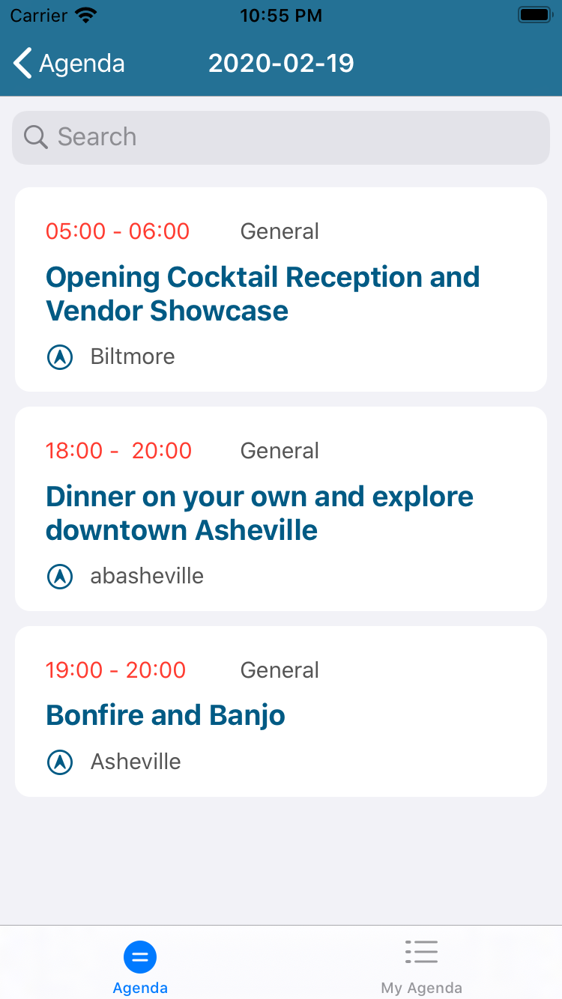
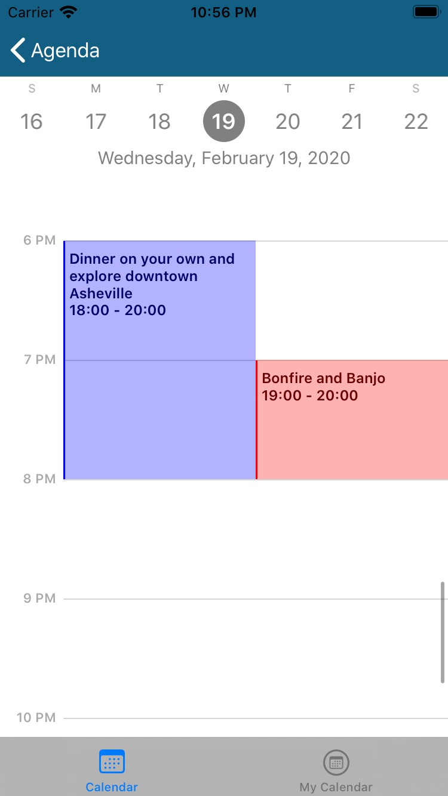
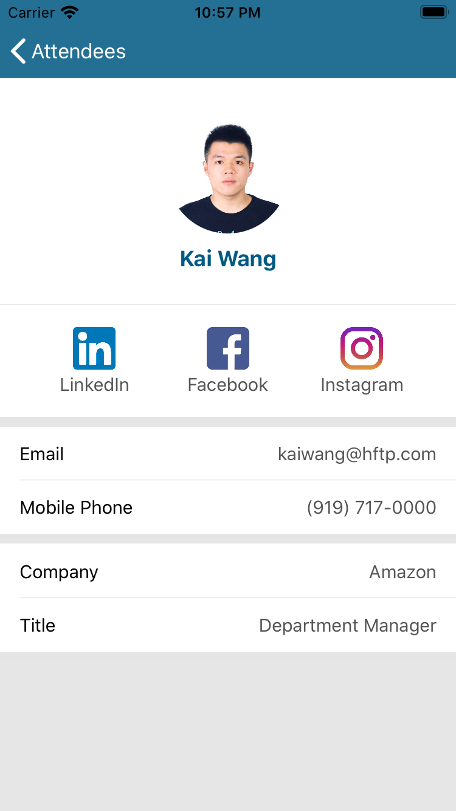
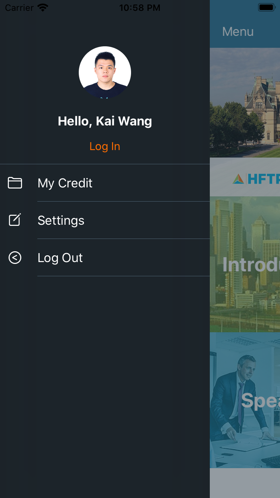
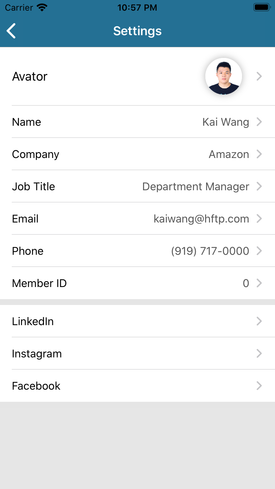

# HFTP -- ECE564 Project

## **Overview**
- **Track all information of HFTP conference**
- Hftp: An organization that holds a series of conferences for the continuing education of hospitality professionals

## **Basic Functions**

### **1. Conference Introduction**
- A brief introduction of the history and goals of HFTP conference

### **2. Conference Agenda**
- Search bar for users so they can search sessions by date, type, title, location
- Sessions can be displayed in Table/Calendar Display Mode accroding to user’s need

- Users are able to Add/Remove a session from their own calendar
- Once the user adds a session to his/her calender, he/she becomes one of the attendees of that session
- If a user wants to know more about a session, he/she can check Session Details: Introduction, date, time period, location, participants(speakers & attendees)

### **3. Conference Speakers**
- Search bar for users so they can search speakers by name 
- All the speakers' information (name, title and email) and sessions to give lectures are available

### **4. Conference Attendees**
- If a user add some sessions to his/her calendar, he/she will be in the attendee list
- Search bar for users so they can search attendees by name 
- All the speakers' information (name, title, email and phone number) and their social media (LinkedIn, Instagram, Facebook) are available

### **5. Side Menu**
- Users can Edit/Save their information in settings
- Users’ are able to check their attended sessions and credits in My Credit
- Users can login and logout in the side menu (several accounts in the picker view to choose from, password: hftp2020)

